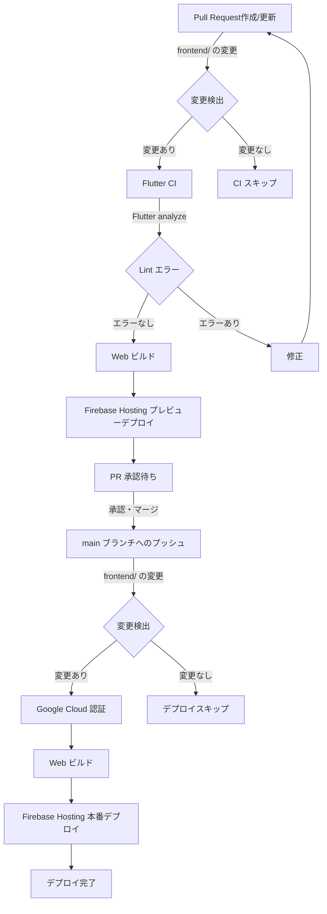

# 第 ７ 回 FlutterGakkai セッション用デモアプリ - AI キャラクタージェネレーター

Flutter と Cloud Run functions for Firebase (2nd Gen), Genkit を使用して AI キャラクターを生成するサンプルアプリケーションです。

## 🌟 特徴

- AI によるキャラクター画像生成 (Imagen3)
- キャラクター設定からの自然な説明文生成 (Gemini)
- Firebase Authentication による API レベルの認証管理

## 📁 プロジェクト構成

```plain
flutter-gakkai-07/
├── .github/        # CI/CD ワークフロー
├── genkit/         # Genkit プロジェクト
│ ├── package.json  # 依存関係
│ ├── prompts       # Dotprompt によるプロンプト管理
│ └── src/
│   └── index.ts    # Genkit 関数本体の実装
├── lib/            # Flutter アプリのソースコード
│ ├── data/         # データ層 (Repository, API Client)
│ │ ├── auth/       # Firebase 認証関連
│ │ ├── env/        # 環境変数管理
│ │ └── genkit/     # Genkit API 通信
│ ├── ui/           # UI 層
│ └── usecase/      # ユースケース層
└── ...
```

## CI/CD

## フロントエンド (Flutter)



### バックエンド (Firebase Genkit)

```mermaid
graph TD
    A[Pull Request作成/更新] -->|backend/ の変更| B{変更検出}
    B -->|変更あり| C[Functions CI]
    C -->|Lint チェック| D{Lint エラー}
    D -->|エラーなし| E[PR 承認待ち]
    D -->|エラーあり| F[修正]
    F --> A
    E -->|承認・マージ| G[main ブランチへのプッシュ]
    G -->|backend/ の変更| H{変更検出}
    H -->|変更あり| I[Google Cloud 認証]
    I --> J[Dependencies インストール]
    J --> K[Cloud Run functions for Firebase (2nd Gen) デプロイ]
    K --> L[デプロイ完了]
    B -->|変更なし| M[CI スキップ]
    H -->|変更なし| N[デプロイスキップ]
```

## 🗒️ 参考

- [Firebase Genkit Functions 開発のすゝめ](https://zenn.dev/nozomi_cobo/articles/genkit-emulator-suite)
- [Flutter × Genkit × Imagen 3 で始める AI 画像生成アプリ開発入門](https://zenn.dev/nozomi_cobo/articles/flutter-genkit-imagen)
- [Firebase & AI のオーケストレーションを実現！Genkit アーキテクチャ 8 選](https://zenn.dev/nozomi_cobo/articles/genkit-architecture)
